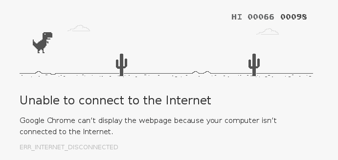
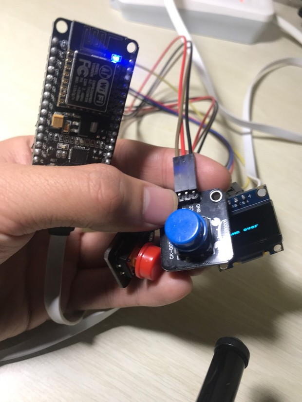
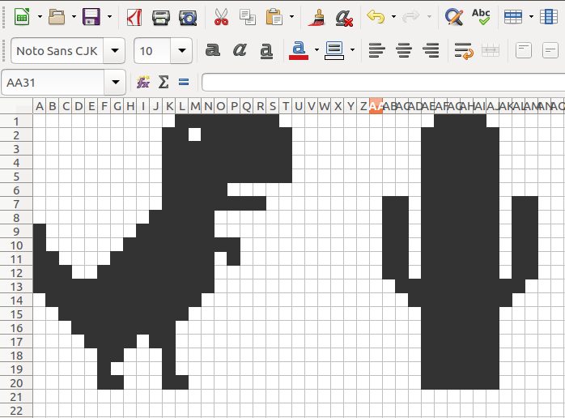
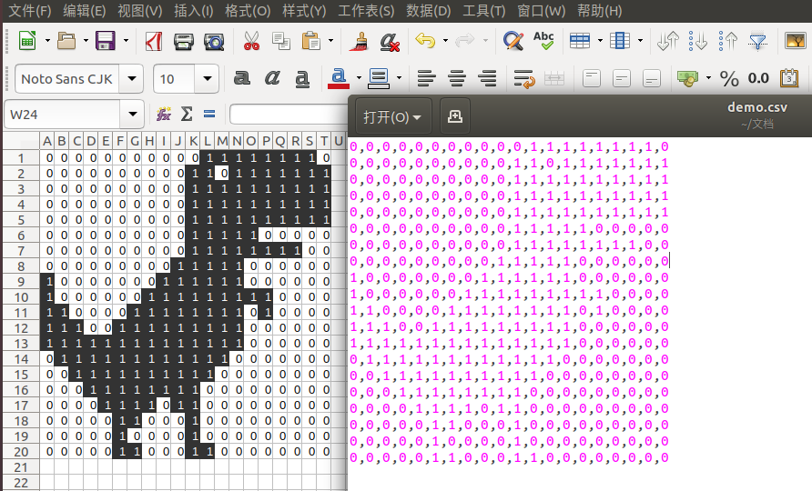
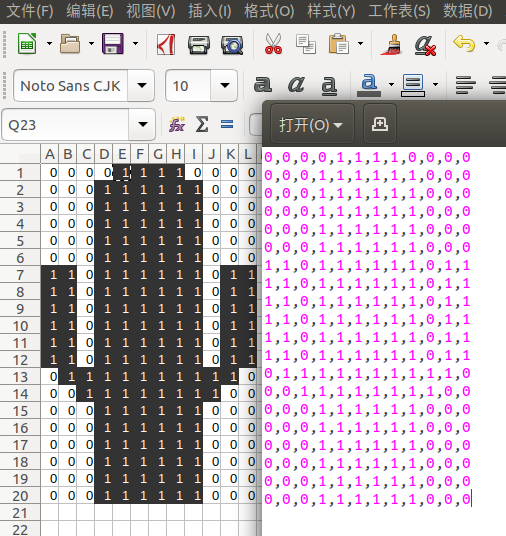
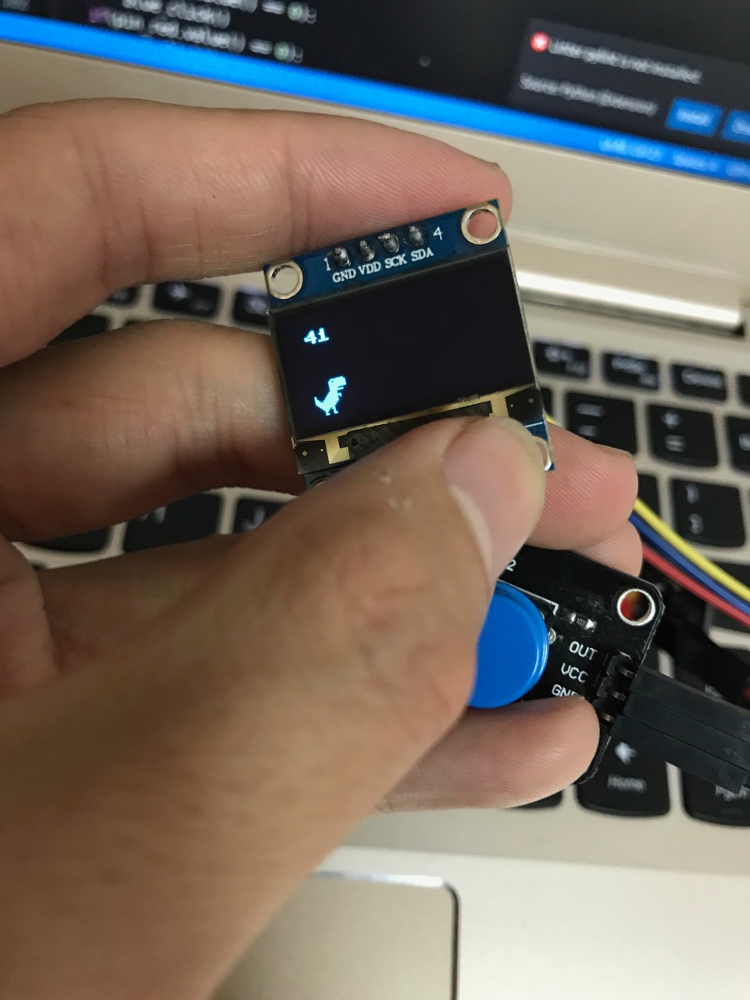

# chrome offline game on esp8266

当前更新到2.0版本

请猛戳此处 https://github.com/OpensourceBooks/chrome_offline_game_on_esp8266/blob/master/v2/README.md

以下是1.0版本

在esp8266上面开发一款chrome浏览器离线时可玩的那款恐龙跳仙人掌的游戏。

### 原型

游戏的原型是chrome浏览器在离线时呈现的小恐龙跳仙人掌的游戏



视频演示地址：https://raw.githubusercontent.com/OpensourceBooks/chrome_offline_game_on_esp8266/master/demo.mp4

------

### 制作过程

所需的元器件：

1. NodeMCU（esp8266芯片、4M内存）
2. 12864 oled （ssd1306 驱动）
3. 大按键按钮 （低电平触发）
4. 杜邦线若干（母对母）

组装的效果图：



### 使用excel表格，制作游戏的像素图案

1. 使用excel表格，绘制恐龙和仙人掌

   

2. 用1和0进行填充，保存为csv文件，并用文本编辑器打开

   

   

3. 写到代码里

   ```
   player = {}
   player["x"] = 10
   player["y"] = 44
   player["pixel"] = [
           (0,0,0,0,0,0,0,0,0,0,0,1,1,1,1,1,1,1,1,0),
           (0,0,0,0,0,0,0,0,0,0,1,1,0,1,1,1,1,1,1,1),
           (0,0,0,0,0,0,0,0,0,0,1,1,1,1,1,1,1,1,1,1),
           (0,0,0,0,0,0,0,0,0,0,1,1,1,1,1,1,1,1,1,1),
           (0,0,0,0,0,0,0,0,0,0,1,1,1,1,1,1,1,1,1,1),
           (0,0,0,0,0,0,0,0,0,0,1,1,1,1,1,0,0,0,0,0),
           (0,0,0,0,0,0,0,0,0,0,1,1,1,1,1,1,1,1,0,0),
           (0,0,0,0,0,0,0,0,0,1,1,1,1,1,0,0,0,0,0,0),
           (1,0,0,0,0,0,0,0,1,1,1,1,1,1,0,0,0,0,0,0),
           (1,0,0,0,0,0,0,1,1,1,1,1,1,1,1,1,0,0,0,0),
           (1,1,0,0,0,0,1,1,1,1,1,1,1,1,0,1,0,0,0,0),
           (1,1,1,0,0,1,1,1,1,1,1,1,1,1,0,0,0,0,0,0),
           (1,1,1,1,1,1,1,1,1,1,1,1,1,1,0,0,0,0,0,0),
           (0,1,1,1,1,1,1,1,1,1,1,1,1,0,0,0,0,0,0,0),
           (0,0,1,1,1,1,1,1,1,1,1,1,0,0,0,0,0,0,0,0),
           (0,0,0,1,1,1,1,1,1,1,1,0,0,0,0,0,0,0,0,0),
           (0,0,0,0,1,1,1,1,0,1,1,0,0,0,0,0,0,0,0,0),
           (0,0,0,0,0,1,1,0,0,0,1,0,0,0,0,0,0,0,0,0),
           (0,0,0,0,0,1,0,0,0,0,1,0,0,0,0,0,0,0,0,0),
           (0,0,0,0,0,1,1,0,0,0,1,1,0,0,0,0,0,0,0,0)
       ]
   ```


   

4. 循环像素，显示小恐龙：

   ```
   pixels = player["pixel"]
   
       if(status["is_jump"]):
           player["y"]-=3
           if(player["y"]<15):
               status["is_jump"]=False
       else:
           player["y"]+=3
           if(player["y"]>=43):
               player["y"]=43
               status["is_jumpfinish"]=True
   
       for i in range(0,len(pixels)):
           for ii in range(0,len(pixels[i])):
               oled.pixel(player["x"]+ii,player["y"]+i,pixels[i][ii])
   ```

   


这里提供一个绘制好的excel文件 game.xls

最后，代码全部在本仓库里。


欢迎喜欢玩esp8266的一起来切磋，微信号：cr4fun

视频演示地址：https://raw.githubusercontent.com/OpensourceBooks/chrome_offline_game_on_esp8266/master/demo.mp4