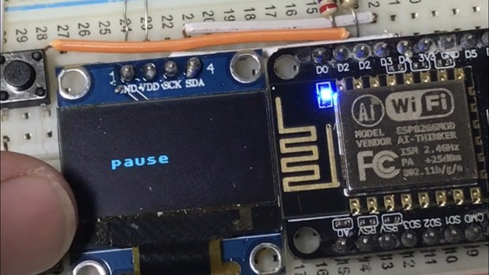
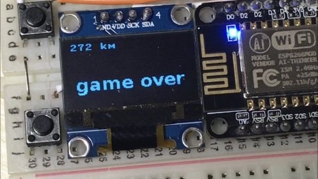

### 版本2

第一个版本的恐龙、仙人掌是用循环数组逐点像素实现的，每帧显示都重新绘制一边，这种绘制的算法没有优化，因此可以看到有卡顿。

版本2中，不再使用excel表格而是使用pbm格式的图片。

如下所示，这是把游戏玩家的像素图读出来。

```
with open('player.pbm', 'rb') as f:
    f.readline() # Magic number
    f.readline() # Creator comment
    f.readline() # Dimensions
    data = bytearray(f.read())
player["buf_jump"] = framebuf.FrameBuffer(data, 20, 20, framebuf.MONO_HLSB)
```

到需要绘制的时候，无需循环像素，而是使用内置的函数来绘制。

```
oled.blit(player["buf_jump"], player["x"], player["y"])
```

v2版本增加了暂停，其实这很容易，就是针对2个按钮来使用状态机：

```
def blue_click():
    if(status["is_jumpfinish"]):
        status["is_jump"]=True
        status["is_jumpfinish"]=False
    
def red_click():
    if(status["game"]=="ready"):
        status["game"]="playing"
    elif(status["game"]=="playing"):
        status["game"]="pause"
    elif(status["game"]=="pause"):
        status["game"]="playing"
    elif(status["game"]=="gameover"):
        begin()
        status["game"]="playing"
    
```

进行时的界面


暂停时的界面


游戏结束时的界面


演示：
https://raw.githubusercontent.com/OpensourceBooks/chrome_offline_game_on_esp8266/master/demo2.mp4